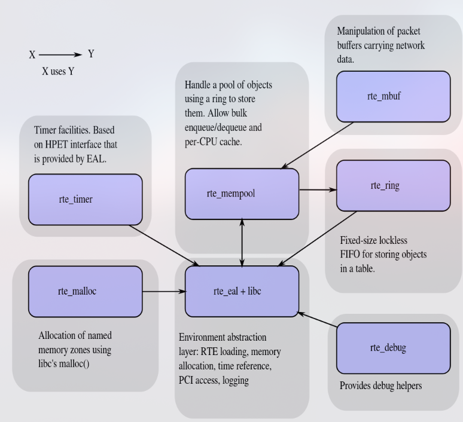

# DPDK research

## Terminology
1. NIC = network interface card
1. pNIC = phyiscal NIC
1. vNIC = virtual NIC
1. pF = physical function
1. vF = virtual function
1. DPDK = data plane development kit
1. PMD = DPDK's poll mode driver
1. EAL = Envrionment Abstraction Layer
1. UIO = userspace io
1. VFIO = virtual function io
1. NFV = network function virtualization

## Overview

### Usage
1. #### What
    To speed up the packet processing in linux.
1. #### Why
    By defualt, the packet went through kernel space, which requires context switch and causes interrupts.
1. #### When
    Typically when handling network over 10Gbits/s.
1. #### Where
    On linux machine that has phyisical NIC that supports DPDK.
1. #### How
    Using PMD to constantly polling packet from NIC with UIO. Instead of NIC raising interrupts to PC when frame is recived.
    
1. #### Comparison
    1. ##### Kernel:
        According to (R5), DPDK is 4.2x performant over unoptimized kernel stack and 1.5x performant over optimized kernel stack.
        The advantage of DPDK has a performance advantage and also easier setup compared to the kernel optimization.
    1. ##### RDMA:
        Both are kernel bypass technology. DPDK moves the stack up to the user space while RDMA brought the stack down to hardware level.
        ###### In comparison:
        1. DPDK still requires the computation power of CPU while RDMA only depends on the physical NIC.
            e.g. DPDK is limited by the core number of CPU.
        1. DPDK requires the reservation of system resource which occupies CPU even when there is low load. (can be optimized)
        1. DPDK has control over the stack, user can customized the rule. RDMA does not allow the customization.
        1. RDMA is mainly used for cross node task such as two phsical node communication with each other,
        1. DPDK is more suited for task that requires highly customized stack/routing.
    1. ##### SR-IOV:
        Both are kernel bypass technology. 
        ###### In comparison:
        1. SR-IOV provides virtual functions on the pNIC and allow user space application (VM)
            to connect to it via PCI passthrough.
        1. SR-IOV natively supports VM, while DPDK requires user to implements network stack(TCP/UDP).
        1. SR-IOV relies on vlan/vxlan to manage traffic. DPDK has more stack and filtering options.

    1. ##### Conclusion
        SR-IOV/RDMA is more dependent on the pNIC. DPDK is more flexible and portable since it is mostly implemented by user space software.
        DPDK allows high customizability on the network stack and filtering with the trade off that the performance is bottlenecked by CPU.
        (Mainly for PMD)

        Performance wise, DPDK generally performs better in east-west (vm to vm within same physical node) traffic scenario.
        While in north-south (vm to vm cross different physical node) traffic solution such as SR-IOV is better.

        There are solution like VFd that combines DPDK and SR-IOV
1. #### Common tools
    1. Numa = non-uniformed memory access
    1. HugePages = Larger memory pages means less TLB look up.
    1. VFIO = DPDK use VFIO in user space to connect with other application(VM)
    1. DPDK scripts
        1. dpdk-devbind.py: bind/unbind NIC driver to pNIC.
        1. dpdk-hugepages.py: automate the management of hugepage.
        1. cpu_layout.py: shows numa topology, core distribution etc.
        1. dpdk-setup.py: interactive script that compile dpdk, load kernel module, bind NIC, manage hugepage etc.
        1. dpdk-pmdinfo.py: analysing the metadata of pmd.
        1. dpdk-testpmd: spin up a pmd for testing (needs to be compile first, could be find under /app of the project).

## Solution
1. Raw DPDK
    1. WIP
1. Ovs + DPDK (Need pNIC support)
1. DPDK + SR-IOV (Need pNIC support)

## Reference(R)
1. DPDK vs. SR-IOV: https://telcocloudbridge.com/blog/dpdk-vs-sr-iov-for-nfv-why-a-wrong-decision-can-impact-performance/
2. VFd: https://www.dpdk.org/wp-content/uploads/sites/35/2017/09/DPDK-Userspace2017-Day2-3-VFd.pdf
3. OVS + DPDK: https://www.intel.com/content/www/us/en/developer/articles/technical/open-vswitch-with-dpdk-overview.html
4. Cisco ovs + dpdk: https://www.cisco.com/c/en/us/support/docs/routers/enterprise-nfv-infrastructure-software/221679-understand-nfvis-virtual-networks-ovs.html?dtid=osscdc000283
5. DPDK vs. Kernel: https://talawah.io/blog/linux-kernel-vs-dpdk-http-performance-showdown/
